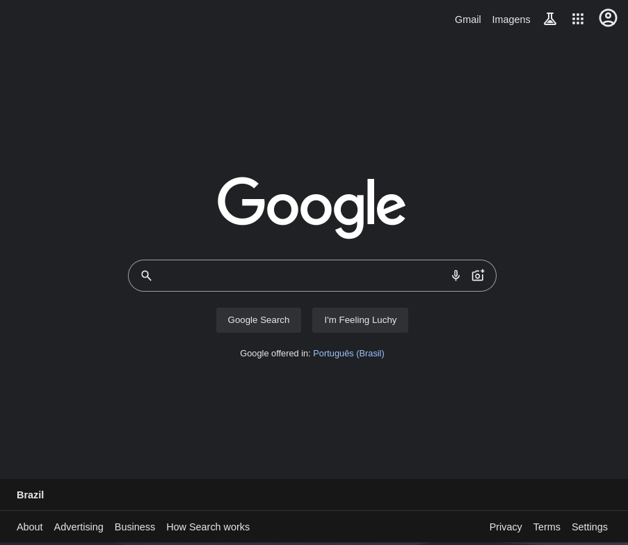

<h1 align="center"> Clone google.com </h1>

Projeto desenvolvido como forma de prática em desenvolvimento front-end.

<!--

  <a href="https://samuelcarneiro.github.io/clone-pg-google/">Clique aqui para acessar o site</a>&nbsp;&nbsp;&nbsp;&nbsp;&nbsp;&nbsp;

-->

 

  

## 🚀 Tecnologias

